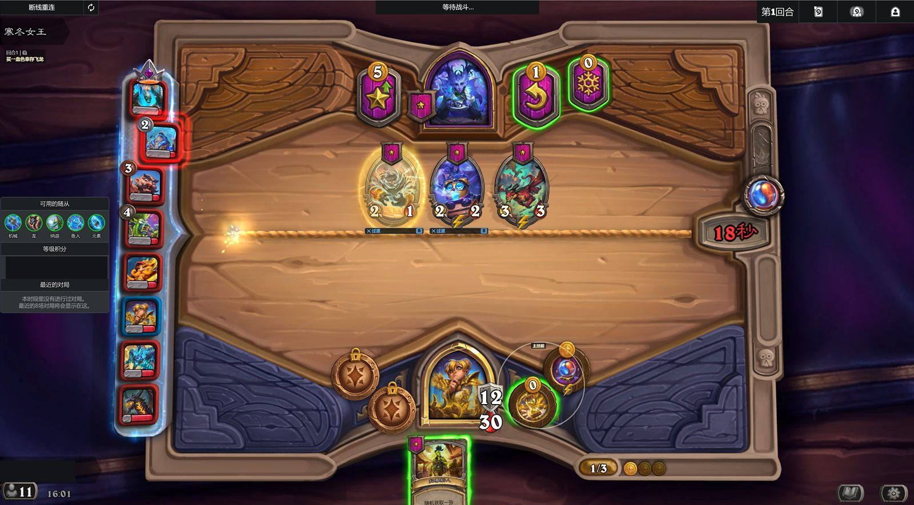
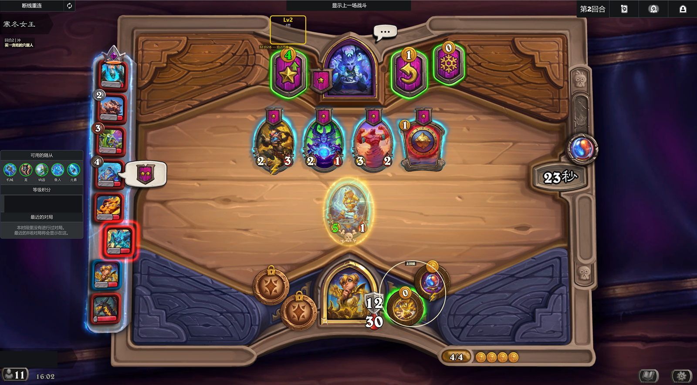
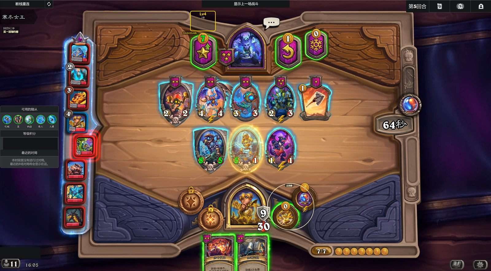
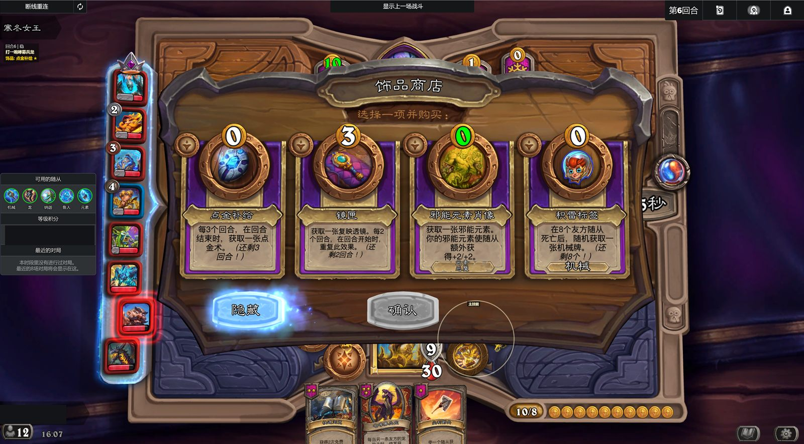
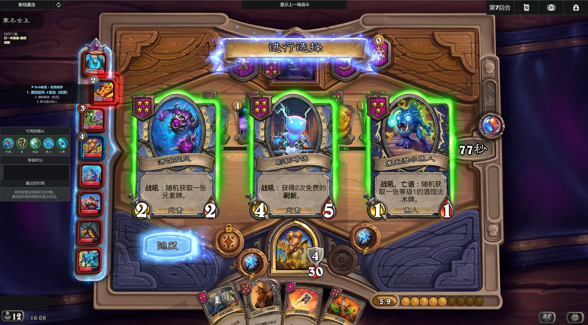

# Bob Coach 功能展示

BobCoach 会根据当前对局给出醒目的操作建议，帮助你在回合时间里更快做决定。它只提供建议，不会自动操作游戏，最终选择始终由玩家完成。

[离线打开 HTML 功能展示页](FEATURES.html) · [查看安装教程](INSTALL.md)

## 购买建议

商店里同时出现多个随从时，BobCoach 会标出当前阵容更值得购买的目标，减少反复比较的时间。

## 升本建议

当这一回合适合升级酒馆等级时，BobCoach 会在升本按钮附近给出提示，帮助你权衡战力和成长节奏。

## 技能提示

英雄技能容易被忙碌操作忽略时，BobCoach 会提醒更合适的使用时机。

## 饰品推荐

面对多件饰品时，BobCoach 会结合当前对局标出更合适的选择，玩家仍可查看全部效果后自行决定。

## 发现选择

遇到三选一等发现界面时，BobCoach 会辅助比较候选项，让关键选择更直观。

截图中的玩家名称和分数已经过隐私处理。游戏画面与名称归各自权利人所有，Bob Coach 是独立社区项目。
