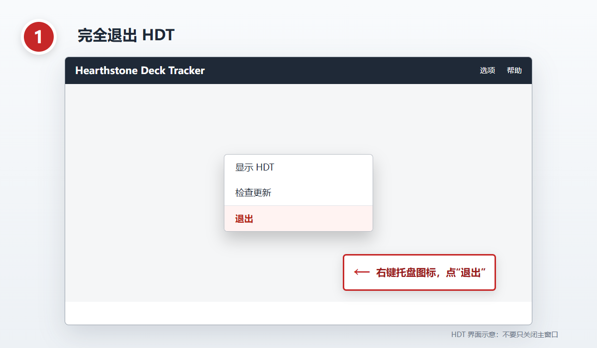
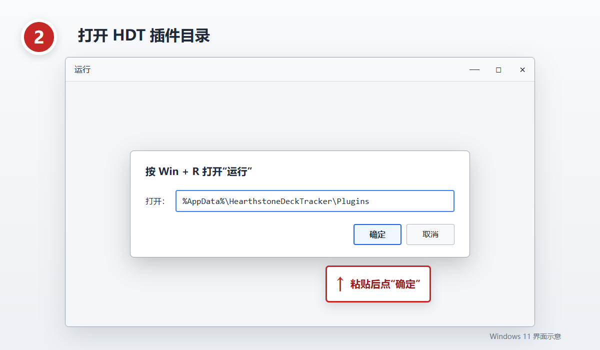
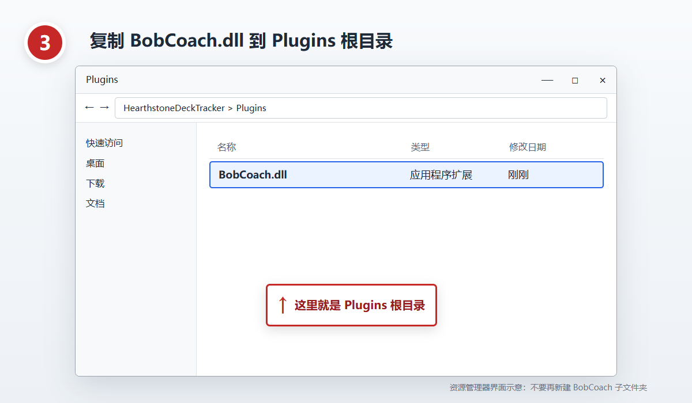
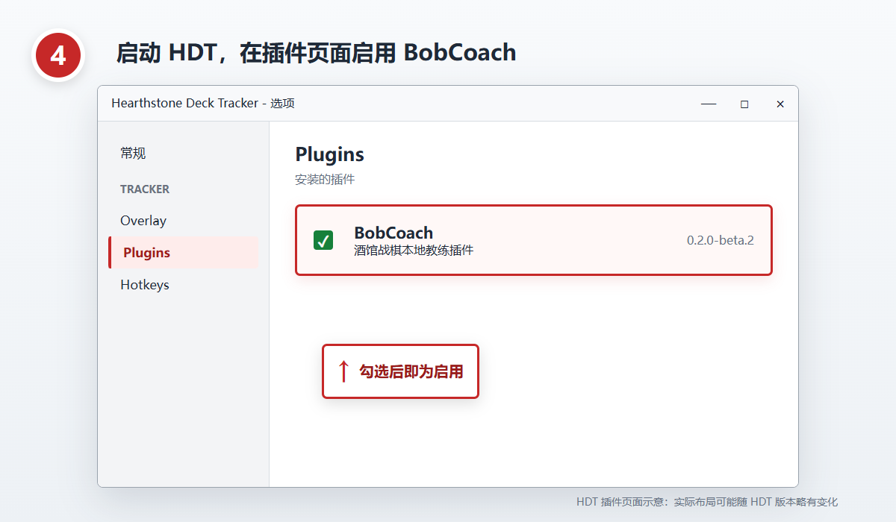

# Bob Coach 中文安装教程

不熟悉终端也能完成。先下载官方安装包 [BobCoach-0.2.0-beta.1-win-x64.zip](https://github.com/yueyang9999/HDT-BobCoach/releases/download/v0.2.0-beta.1/BobCoach-0.2.0-beta.1-win-x64.zip)。当前公开的 `0.2.0-beta.1` 只需复制 `BobCoach.dll`；后续 `1.0.0` 安装包发布后，完整解压应同时看到 `BobCoach.dll` 和 `BobCoach.dll.sha256`。

[下载或离线打开 HTML 图文教程](INSTALL.html)

## 四步安装

### 第 1 步：完全退出 HDT

在 Windows 右下角通知区域找到 HDT 图标，右键后选择“退出”。不要只关闭 HDT 主窗口；它可能仍在后台运行。



图示：右键 HDT 通知区域图标，选择“退出”。HDT 界面可能随版本略有变化。

### 第 2 步：打开插件目录

按 `Win + R`，粘贴下面这条路径，然后点“确定”：

```text
%AppData%\HearthstoneDeckTracker\Plugins
```

如果系统提示目录不存在，请先正常启动并退出一次 HDT，然后重试。



图示：在“运行”窗口粘贴插件目录路径并点“确定”。

### 第 3 步：复制 DLL 和校验文件

回到解压后的安装包：当前公开的 `0.2.0-beta.1` 只复制 `BobCoach.dll`；`1.0.0` 发布后，将 `BobCoach.dll` 和 `BobCoach.dll.sha256` 一起复制到刚打开的 `Plugins` 根目录。两个 1.0.0 文件必须来自同一个安装包；缺少校验文件或哈希不匹配时，插件会拒绝启动。升级 1.0.0 时同时替换两个文件。不要再创建 `BobCoach` 子文件夹，也不要复制到 HDT 程序安装目录。



图示：`BobCoach.dll` 应直接位于 `Plugins` 根目录；`1.0.0` 还必须在同目录放置 `BobCoach.dll.sha256`。

### 第 4 步：启动并启用 BobCoach

重新启动 HDT，打开 `Options > Tracker > Plugins`，找到 BobCoach 并勾选启用。关闭并重启一次 HDT，再确认 BobCoach 仍为启用状态。



图示：在 HDT 插件页面启用 BobCoach；实际布局可能随 HDT 版本略有变化。

## 下载时注意

当前最新公开版本仍为 `0.2.0-beta.1`，官方文件名是 `BobCoach-0.2.0-beta.1-win-x64.zip`。仓库源码版本已调整为 `1.0.0`，目前只处于本地发布候选阶段，尚未创建 GitHub Release，也未公开上传安装包。官方安装包只通过本仓库的 [GitHub Releases](https://github.com/yueyang9999/HDT-BobCoach/releases) 提供。

- `Windows 11 24H2 x64` 与 `Windows 10 22H2 x64` 使用同一个 64 位安装包。
- 不要下载 Release 页面底部的 `Source code (zip)` 或 `Source code (tar.gz)`；它们是源码快照，不是安装包。
- 不要混用不同版本的 DLL、manifest 或校验文件。
- 安装不需要 Node.js、Visual Studio或管理员权限。

## 常见问题

### 插件列表没有 BobCoach

1. 确认 HDT 已完全退出后再复制文件；beta.1 只需 DLL，1.0.0 必须同时复制 DLL 和校验文件。
2. beta.1 确认 `%AppData%\HearthstoneDeckTracker\Plugins\BobCoach.dll` 存在；1.0.0 还要确认相邻的 `BobCoach.dll.sha256` 存在。
3. 右键 `BobCoach.dll`，打开“属性”；如果底部有“解除锁定”，勾选后确定。
4. 重新启动 HDT，再到 `Options > Tracker > Plugins` 检查。

### 覆盖后仍显示旧版本

确认只在上述 AppData 插件目录保留当前 `BobCoach.dll` 和相邻校验文件，不要同时向 HDT 程序目录复制。完全退出 HDT，用同一个安装包重新覆盖两个文件后再启动。

### 插件能加载但对局提示不完整

部分功能需要 Hearthstone 的 `Power.log`。Bob Coach 不会静默修改 `log.config`；请在 HDT 的“Bob 教练”入口查看拟议变更并自行确认。拒绝修改不会阻止插件加载，但相关对局功能会失败关闭。

## 可选高级安装

普通玩家不需要使用终端。需要包完整性校验、自动备份、升级或回退时，可在解压目录运行随包提供的 `INSTALL.ps1`：

```powershell
powershell.exe -NoProfile -ExecutionPolicy Bypass -File .\INSTALL.ps1
```

脚本会校验 `SHA256SUMS.txt`、manifest、DLL 与相邻 SHA 文件的绑定、DLL 版本与 x64 架构，并只写入同一个 AppData 插件目录。看到 `PASS installed` 或 `PASS upgraded` 表示完成。

详见 [升级](UPGRADE.md)、[回退](ROLLBACK.md)、[卸载](UNINSTALL.md) 和 [故障排查](TROUBLESHOOTING.md)。
